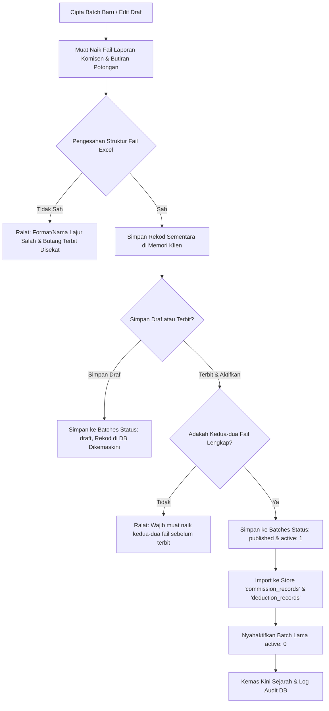
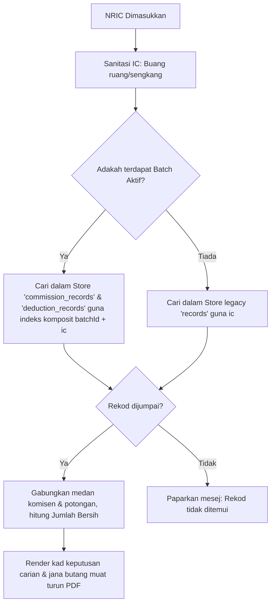

# Pangkalan Data & Aliran Data (Database)

Aplikasi ini menggunakan pangkalan data berasaskan pelayar **IndexedDB** untuk penyimpanan data komisen secara kekal pada komputer pengguna.

---

## 1. Skema IndexedDB (Database Schema)

*   **Nama Pangkalan Data**: `MawarTerajuCommissionDB`
*   **Versi Skema**: `3`

### Struktur Object Stores

Sistem ini mempunyai enam (6) Object Stores utama:

#### A. Store: `batches`
Menyimpan maklumat tempoh batch komisen yang dimuat naik oleh Admin.
*   **Key Path**: `id` (Auto Increment: `true`)
*   **Index**:
    *   `active` (Unique: `false`) - Indeks untuk menjejaki batch yang aktif (`1` = aktif, `0` = tidak aktif).

| Medan (Property) | Jenis Data | Penerangan | Contoh Nilai |
| :--- | :--- | :--- | :--- |
| `id` | Number | ID Batch (Primary Key) | `1` |
| `name` | String | Nama batch tempoh komisen | `"Julai 2026"` |
| `status` | String | Status batch (`"draft"` / `"published"`) | `"published"` |
| `active` | Number | Bendera status aktif (`1` / `0`) | `1` |
| `createdTime` | Number | Cap masa (timestamp) penciptaan | `1783430513425` |
| `publishedTime`| Number | Cap masa penerbitan (null jika draf) | `1783430536579` |
| `commissionFilename`| String| Nama fail Excel Laporan Komisen | `"commission_july.xlsx"` |
| `deductionFilename` | String| Nama fail Excel Butiran Potongan | `"deductions_july.xlsx"` |
| `commissionCount`| Number | Jumlah rekod komisen diimport | `145` |
| `deductionCount` | Number | Jumlah rekod potongan diimport | `145` |

#### B. Store: `commission_records`
Menyimpan rekod komisen dispatcher bagi setiap batch.
*   **Key Path**: `id` (Auto Increment: `true`)
*   **Index**:
    *   `batchId` (Unique: `false`)
    *   `ic_number` (Unique: `false`)
    *   `batch_ic` (Unique: `true`, Array: `['batchId', 'ic_number']`) - Indeks komposit untuk carian O(1).

| Medan (Property) | Jenis Data | Penerangan | Contoh Nilai |
| :--- | :--- | :--- | :--- |
| `id` | Number | ID Rekod (Primary Key) | `1` |
| `batchId` | Number | Rujukan ke ID Batch | `1` |
| `ic_number` | String | ID Kad Pengenalan (tanpa sengkang) | `"900101141234"` |
| `name` | String | Nama penuh dispatcher | `"Ahmad Bin Ali"` |
| `parcel_qty` | Number | Kuantiti parcel | `150` |
| `parcel_yoyi` | Number | Potongan parcel YOYI | `10` |
| `net_parcel` | Number | Kuantiti parcel bersih | `140` |
| `commission_rate` | Number | Komisen RM1.15 per parcel | `161.00` |
| `exclude_extra_weight_yoyi`| Number | Berat tambahan dikecualikan | `5` |
| `extra_weight_commission` | Number | Komisen berat tambahan | `20.00` |
| `total_commission` | Number | Jumlah kasar komisen | `181.00` |
| `addition_refund_15june26` | Number | Tambahan pulangan wang | `15.00` |
| `addition_pickup_commission`| Number | Komisen kutipan (pickup) | `25.00` |
| `nett_commission` | Number | Komisen bersih kasar | `161.00` |
| `final_amount_to_pay` | Number | Jumlah bayaran bersih akhir | `161.00` |

#### C. Store: `deduction_records`
Menyimpan butiran potongan dispatcher bagi setiap batch.
*   **Key Path**: `id` (Auto Increment: `true`)
*   **Index**:
    *   `batchId` (Unique: `false`)
    *   `ic_number` (Unique: `false`)
    *   `batch_ic` (Unique: `true`, Array: `['batchId', 'ic_number']`) - Indeks komposit untuk carian O(1).

| Medan (Property) | Jenis Data | Penerangan | Contoh Nilai |
| :--- | :--- | :--- | :--- |
| `id` | Number | ID Rekod (Primary Key) | `1` |
| `batchId` | Number | Rujukan ke ID Batch | `1` |
| `ic_number` | String | ID Kad Pengenalan (tanpa sengkang) | `"900101141234"` |
| `name` | String | Nama penuh dispatcher | `"Ahmad Bin Ali"` |
| `deduction_others` | Number | Potongan pinjaman pendahuluan / lain-lain | `50.00` |
| `deduction_pending_cod` | Number | Potongan COD tertangguh | `0.00` |
| `deduction_hq_penalty` | Number | Potongan denda HQ | `10.00` |
| `deduction_duitnow_penalty`| Number | Potongan denda DuitNow | `0.00` |
| `deduction_late_cod_penalty`| Number | Potongan denda COD lewat | `0.00` |
| `deduction_lost_individual`| Number | Potongan barang hilang individu | `0.00` |
| `deduction_lost_parcel_hub`| Number | Potongan barang hilang di hub | `0.00` |

#### D. Store: `records` (Legacy / Fallback)
Menyimpan data komisen bersepadu versi lama sebelum batch diperkenalkan. (Sokongan ke belakang).
*   **Key Path**: `ic_number`

#### E. Store: `history`
Menyimpan log sejarah muat naik fail pentadbir.

#### F. Store: `audit_log`
Menyimpan log aktiviti keselamatan dan carian sistem.

---

## 2. Aliran Data Muat Naik & Validasi (Data Flow Diagram)

Berikut ialah aliran pemprosesan fail sehingga diterbitkan dalam satu batch:

---

## 3. Aliran Carian Dispatcher (Search Flow Diagram)

---

## 4. Peratusan Keselarasan Data & Peraturan Perniagaan
1.  **Indeks Kunci IDB**: IndexedDB menyekat penggunaan Boolean (`true`/`false`) sebagai kunci carian indeks. Oleh itu, sistem menguatkuasakan penggunaan nilai berangka integer `1` (aktif) dan `0` (tidak aktif) pada medan `active` batch.
2.  **Cascade Rollback**: Memadam batch akan secara automatik memicu pemadaman melata ke atas semua rekod komisen dan potongan yang memegang `batchId` berkaitan.
3.  **Sanitasi IC**: Format Kad Pengenalan Malaysia (12 digit) ditapis automatik. Carian disokong untuk format bersih (cth: `"900101141234"`).
