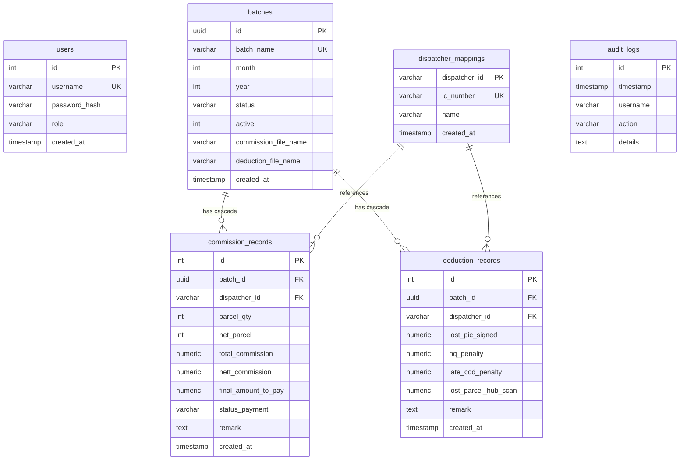

# Database Schema Specification - PostgreSQL

Dokumen ini memperincikan reka bentuk skema pangkalan data hubungan PostgreSQL bagi Commission Lookup System. Skema ini dioptimumkan untuk kelajuan pencarian dispatcher, integriti hubungan (*foreign key constraints*), dan cascading rollback untuk penghapusan batch secara menyeluruh.

---

## 1. Gambar Rajah Hubungan Entiti (ERD)



---

## 2. Struktur Jadual SQL (DDL Schema)

### A. Jadual Pengguna & Log Sistem

#### 1. Jadual Pengguna (`users`)
Storan data kredensial pentadbir (Admin) untuk kawalan RBAC.
```sql
CREATE TABLE users (
    id SERIAL PRIMARY KEY,
    username VARCHAR(50) UNIQUE NOT NULL,
    password_hash VARCHAR(255) NOT NULL,
    role VARCHAR(20) DEFAULT 'admin' CHECK (role IN ('admin', 'dispatch')),
    created_at TIMESTAMP DEFAULT CURRENT_TIMESTAMP
);
```

#### 2. Jadual Log Audit (`audit_logs`)
Jejak audit automatik bagi merekod setiap perlakuan kritikal pentadbir dan carian dispatcher.
```sql
CREATE TABLE audit_logs (
    id SERIAL PRIMARY KEY,
    timestamp TIMESTAMP DEFAULT CURRENT_TIMESTAMP,
    username VARCHAR(50) NOT NULL,
    action VARCHAR(50) NOT NULL,
    details TEXT
);
```

---

### B. Jadual Pengurusan Batch

#### 3. Jadual Batches (`batches`)
Menyimpan data induk untuk setiap batch bulanan komisen yang diimport.
```sql
CREATE TABLE batches (
    id UUID PRIMARY KEY DEFAULT gen_random_uuid(),
    batch_name VARCHAR(100) UNIQUE NOT NULL,
    month INTEGER NOT NULL CHECK (month BETWEEN 1 AND 12),
    year INTEGER NOT NULL CHECK (year >= 2020),
    status VARCHAR(20) DEFAULT 'draft' CHECK (status IN ('draft', 'published', 'archived')),
    active INTEGER DEFAULT 1 CHECK (active IN (0, 1)),
    commission_file_name VARCHAR(255) NOT NULL,
    deduction_file_name VARCHAR(255) NOT NULL,
    created_at TIMESTAMP DEFAULT CURRENT_TIMESTAMP
);
```

---

### C. Jadual Pemetaan & Transaksi Komisen

#### 4. Jadual Pemetaan Dispatcher (`dispatcher_mappings`)
Storan berasingan untuk memetakan Dispatcher ID Kewangan ke Nombor IC yang sah. Data diisi secara automatik semasa pengesahan fail import komisen.
```sql
CREATE TABLE dispatcher_mappings (
    dispatcher_id VARCHAR(50) PRIMARY KEY,
    ic_number VARCHAR(20) UNIQUE NOT NULL,
    name VARCHAR(100) NOT NULL,
    created_at TIMESTAMP DEFAULT CURRENT_TIMESTAMP
);
CREATE INDEX idx_mappings_ic ON dispatcher_mappings(ic_number);
```

#### 5. Jadual Rekod Komisen (`commission_records`)
Menyimpan data pre-calculated komisen dispatcher yang diimport secara pasif daripada Excel.
```sql
CREATE TABLE commission_records (
    id SERIAL PRIMARY KEY,
    batch_id UUID NOT NULL REFERENCES batches(id) ON DELETE CASCADE,
    dispatcher_id VARCHAR(50) NOT NULL REFERENCES dispatcher_mappings(dispatcher_id),
    
    -- Komisen & Volume
    parcel_qty INTEGER DEFAULT 0,
    net_parcel INTEGER DEFAULT 0,
    exclude_extra_weight_yoyi INTEGER DEFAULT 0,
    commission_rate NUMERIC(10, 2) DEFAULT 0.00,
    diff_rate_new_joiner NUMERIC(10, 2) DEFAULT 0.00,
    count_pickup INTEGER DEFAULT 0,
    extra_weight_commission NUMERIC(10, 2) DEFAULT 0.00,
    total_commission NUMERIC(10, 2) DEFAULT 0.00,
    
    -- Penambahan
    addition_pickup_commission NUMERIC(10, 2) DEFAULT 0.00,
    addition_fuel_allowance NUMERIC(10, 2) DEFAULT 0.00,
    addition_sorter NUMERIC(10, 2) DEFAULT 0.00,
    
    -- Potongan
    deduction_advance NUMERIC(10, 2) DEFAULT 0.00,
    deduction_pending_cod NUMERIC(10, 2) DEFAULT 0.00,
    deduction_hq_penalty NUMERIC(10, 2) DEFAULT 0.00,
    deduction_duitnow_penalty NUMERIC(10, 2) DEFAULT 0.00,
    deduction_late_cod_penalty NUMERIC(10, 2) DEFAULT 0.00,
    deduction_lost_individual NUMERIC(10, 2) DEFAULT 0.00,
    deduction_lost_parcel_hub NUMERIC(10, 2) DEFAULT 0.00,
    
    -- Ringkasan
    nett_commission NUMERIC(10, 2) DEFAULT 0.00,
    final_amount_to_pay NUMERIC(10, 2) DEFAULT 0.00,
    
    -- Metadata Excel
    system_reg VARCHAR(50),
    parcel_qty_jms INTEGER DEFAULT 0,
    status_payment VARCHAR(50),
    date_payment VARCHAR(50),
    remark TEXT,
    created_at TIMESTAMP DEFAULT CURRENT_TIMESTAMP
);

-- Indeks komposit untuk pencarian carian pantas
CREATE INDEX idx_comm_batch_disp ON commission_records(batch_id, dispatcher_id);
```

#### 6. Jadual Perincian Potongan (`deduction_records`)
Menyimpan maklumat butiran penalti harian yang diperincikan daripada tab raw Excel.
```sql
CREATE TABLE deduction_records (
    id SERIAL PRIMARY KEY,
    batch_id UUID NOT NULL REFERENCES batches(id) ON DELETE CASCADE,
    dispatcher_id VARCHAR(50) NOT NULL REFERENCES dispatcher_mappings(dispatcher_id),
    
    date_str VARCHAR(20),
    driver_id VARCHAR(50),
    driver_name VARCHAR(100),
    
    -- Kategori Penalti
    lost_pic_signed NUMERIC(10, 2) DEFAULT 0.00,
    pending_cod_returned NUMERIC(10, 2) DEFAULT 0.00,
    hq_penalty NUMERIC(10, 2) DEFAULT 0.00,
    late_cod_penalty NUMERIC(10, 2) DEFAULT 0.00,
    lost_parcel_hub_scan NUMERIC(10, 2) DEFAULT 0.00,
    lost_individual_scan NUMERIC(10, 2) DEFAULT 0.00,
    duitnow_penalty NUMERIC(10, 2) DEFAULT 0.00,
    
    remark TEXT,
    created_at TIMESTAMP DEFAULT CURRENT_TIMESTAMP
);

CREATE INDEX idx_ded_batch_disp ON deduction_records(batch_id, dispatcher_id);
```

---

## 3. Kekunci & Kekangan Integriti (Constraints & Cascade)

1.  **Cascading Deletes**: `ON DELETE CASCADE` ditetapkan pada kekunci asing `batch_id` bagi `commission_records` dan `deduction_records`. Apabila rekod induk di dalam jadual `batches` dipadamkan (Rollback Batch), kesemua rekod data transaksi dan butiran penalti berkaitan akan terpadam secara automatik untuk mengelakkan *orphaned records*.
2.  **Unique Constraints**:
    *   `batches.batch_name` mestilah unik bagi mengelakkan pertindihan nama import fail bagi bulan yang sama.
    *   `dispatcher_mappings.ic_number` mestilah unik untuk memastikan satu dispatcher hanya terikat kepada satu nombor IC yang sah dalam master mapping.
3.  **Check Constraints**:
    *   Bulan mestilah di antara 1 hingga 12.
    *   Tahun mestilah 2020 ke atas.
    *   Status batch hanya boleh diisi dengan `'draft'`, `'published'`, atau `'archived'`.
