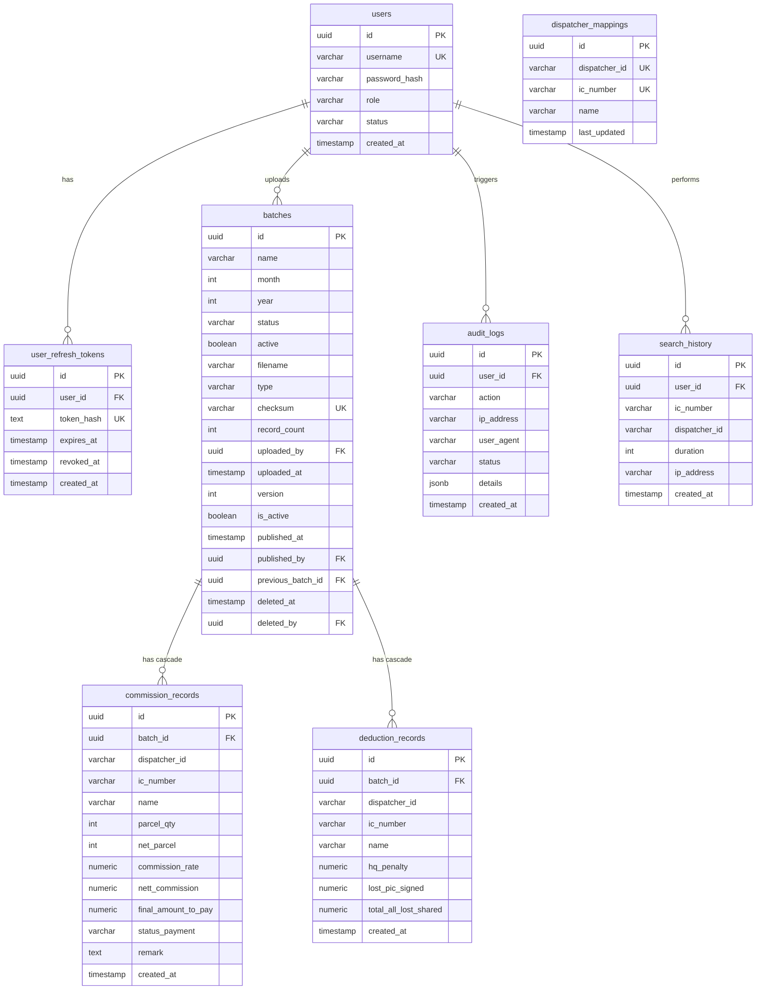

# Database Schema Specification - PostgreSQL

This document details the PostgreSQL relational database schema for the Mawar Teraju Commission System. All tables use cryptographically random UUID primary keys, support session token rotation, and enforce cascading constraint deletion for batch rollbacks.

---

## 1. Entity Relationship Diagram (ERD)



---

## 2. Table Schemas & DDL Definition

### A. Authentication & Audit Logs

#### 1. Table: `users`
```sql
CREATE TABLE users (
    id UUID PRIMARY KEY DEFAULT gen_random_uuid(),
    full_name VARCHAR(255) NOT NULL,
    username VARCHAR(100) UNIQUE NOT NULL,
    password_hash VARCHAR(255) NOT NULL,
    role VARCHAR(50) NOT NULL CHECK (role IN ('ADMIN', 'DISPATCH')),
    status VARCHAR(50) NOT NULL DEFAULT 'ACTIVE' CHECK (status IN ('ACTIVE', 'INACTIVE')),
    created_at TIMESTAMP WITH TIME ZONE DEFAULT CURRENT_TIMESTAMP,
    updated_at TIMESTAMP WITH TIME ZONE DEFAULT CURRENT_TIMESTAMP
);
CREATE INDEX idx_users_username ON users(username);
```

#### 2. Table: `user_refresh_tokens`
```sql
CREATE TABLE user_refresh_tokens (
    id UUID PRIMARY KEY DEFAULT gen_random_uuid(),
    user_id UUID NOT NULL REFERENCES users(id) ON DELETE CASCADE,
    token_hash TEXT NOT NULL UNIQUE,
    expires_at TIMESTAMP WITH TIME ZONE NOT NULL,
    revoked_at TIMESTAMP WITH TIME ZONE NULL,
    created_at TIMESTAMP WITH TIME ZONE DEFAULT CURRENT_TIMESTAMP
);
CREATE INDEX idx_refresh_tokens_hash ON user_refresh_tokens(token_hash);
```

#### 3. Table: `audit_logs`
```sql
CREATE TABLE audit_logs (
    id UUID PRIMARY KEY DEFAULT gen_random_uuid(),
    user_id UUID NULL REFERENCES users(id) ON DELETE SET NULL,
    action VARCHAR(255) NOT NULL,
    ip_address VARCHAR(45) NOT NULL,
    user_agent VARCHAR(500) NOT NULL,
    status VARCHAR(50) NOT NULL,
    details JSONB NULL,
    created_at TIMESTAMP WITH TIME ZONE DEFAULT CURRENT_TIMESTAMP
);
CREATE INDEX idx_audit_logs_action ON audit_logs(action);
CREATE INDEX idx_audit_logs_created_at ON audit_logs(created_at);
```

#### 4. Table: `search_history`
```sql
CREATE TABLE search_history (
    id UUID PRIMARY KEY DEFAULT gen_random_uuid(),
    user_id UUID NULL REFERENCES users(id) ON DELETE SET NULL,
    ic_number VARCHAR(20) NULL,
    dispatcher_id VARCHAR(100) NULL,
    duration INTEGER NOT NULL, -- in milliseconds
    ip_address VARCHAR(45) NOT NULL,
    created_at TIMESTAMP WITH TIME ZONE DEFAULT CURRENT_TIMESTAMP
);
CREATE INDEX idx_search_history_user ON search_history(user_id);
CREATE INDEX idx_search_history_created_at ON search_history(created_at);
```

---

### B. Batch Management

#### 5. Table: `batches`
```sql
CREATE TABLE batches (
    id UUID PRIMARY KEY DEFAULT gen_random_uuid(),
    name VARCHAR(100) NOT NULL,
    month INTEGER NOT NULL CHECK (month BETWEEN 1 AND 12),
    year INTEGER NOT NULL CHECK (year >= 2020),
    status VARCHAR(50) NOT NULL DEFAULT 'DRAFT' CHECK (status IN ('DRAFT', 'VALIDATING', 'IMPORTING', 'IMPORTED', 'PUBLISHED', 'ARCHIVED')),
    active BOOLEAN NOT NULL DEFAULT FALSE,
    filename VARCHAR(255) NOT NULL,
    type VARCHAR(50) NOT NULL CHECK (type IN ('COMMISSION', 'DEDUCTION')),
    checksum VARCHAR(64) UNIQUE NOT NULL,
    record_count INTEGER NOT NULL DEFAULT 0,
    uploaded_by UUID NOT NULL REFERENCES users(id) ON DELETE RESTRICT,
    uploaded_at TIMESTAMP WITH TIME ZONE DEFAULT CURRENT_TIMESTAMP,
    created_at TIMESTAMP WITH TIME ZONE DEFAULT CURRENT_TIMESTAMP,
    updated_at TIMESTAMP WITH TIME ZONE DEFAULT CURRENT_TIMESTAMP,
    
    -- Enterprise Batch Management columns
    version INTEGER NOT NULL DEFAULT 1,
    is_active BOOLEAN NOT NULL DEFAULT FALSE,
    published_at TIMESTAMP WITH TIME ZONE NULL,
    published_by UUID NULL REFERENCES users(id) ON DELETE SET NULL,
    previous_batch_id UUID NULL REFERENCES batches(id) ON DELETE SET NULL,
    deleted_at TIMESTAMP WITH TIME ZONE NULL,
    deleted_by UUID NULL REFERENCES users(id) ON DELETE SET NULL
);
CREATE INDEX idx_batches_name ON batches(name);
CREATE INDEX idx_batches_active ON batches(active);
CREATE INDEX idx_batches_checksum ON batches(checksum);
CREATE INDEX idx_batches_is_active ON batches(is_active);
CREATE INDEX idx_batches_previous_batch_id ON batches(previous_batch_id);
```

---

### C. Dispatcher Mappings & Records

#### 6. Table: `dispatcher_mappings`
```sql
CREATE TABLE dispatcher_mappings (
    id UUID PRIMARY KEY DEFAULT gen_random_uuid(),
    dispatcher_id VARCHAR(100) UNIQUE NOT NULL,
    ic_number VARCHAR(20) NOT NULL, -- Unique constraint removed to support 1-to-many lookup
    name VARCHAR(255) NOT NULL,
    last_updated TIMESTAMP WITH TIME ZONE DEFAULT CURRENT_TIMESTAMP
);
CREATE INDEX idx_dispatcher_mappings_ic ON dispatcher_mappings(ic_number);
```

#### 7. Table: `commission_records`
```sql
CREATE TABLE commission_records (
    id UUID PRIMARY KEY DEFAULT gen_random_uuid(),
    batch_id UUID NOT NULL REFERENCES batches(id) ON DELETE CASCADE,
    dispatcher_id VARCHAR(100) NOT NULL,
    ic_number VARCHAR(20) NOT NULL,
    name VARCHAR(255) NOT NULL,
    
    parcel_qty INTEGER NOT NULL DEFAULT 0,
    net_parcel INTEGER NOT NULL DEFAULT 0,
    exclude_extra_weight_yoyi INTEGER NOT NULL DEFAULT 0,
    commission_rate NUMERIC(15, 4) NOT NULL DEFAULT 0.0000,
    diff_rate_new_joiner NUMERIC(15, 4) NOT NULL DEFAULT 0.0000,
    count_pickup INTEGER NOT NULL DEFAULT 0,
    extra_weight_commission NUMERIC(15, 4) NOT NULL DEFAULT 0.0000,
    total_commission NUMERIC(15, 4) NOT NULL DEFAULT 0.0000,
    
    addition_pickup_commission NUMERIC(15, 4) NOT NULL DEFAULT 0.0000,
    addition_fuel_allowance NUMERIC(15, 4) NOT NULL DEFAULT 0.0000,
    addition_sorter NUMERIC(15, 4) NOT NULL DEFAULT 0.0000,
    
    deduction_advance NUMERIC(15, 4) NOT NULL DEFAULT 0.0000,
    deduction_pending_cod NUMERIC(15, 4) NOT NULL DEFAULT 0.0000,
    deduction_hq_penalty NUMERIC(15, 4) NOT NULL DEFAULT 0.0000,
    deduction_duitnow_penalty NUMERIC(15, 4) NOT NULL DEFAULT 0.0000,
    deduction_late_cod_penalty NUMERIC(15, 4) NOT NULL DEFAULT 0.0000,
    deduction_lost_individual NUMERIC(15, 4) NOT NULL DEFAULT 0.0000,
    deduction_lost_parcel_hub NUMERIC(15, 4) NOT NULL DEFAULT 0.0000,
    
    nett_commission NUMERIC(15, 4) NOT NULL DEFAULT 0.0000,
    final_amount_to_pay NUMERIC(15, 4) NOT NULL DEFAULT 0.0000,
    
    system_reg VARCHAR(100) NULL,
    parcel_qty_jms INTEGER NOT NULL DEFAULT 0,
    status_payment VARCHAR(50) NOT NULL DEFAULT 'SUCCESS',
    date_payment VARCHAR(50) NULL,
    remark TEXT NULL,
    
    created_at TIMESTAMP WITH TIME ZONE DEFAULT CURRENT_TIMESTAMP,
    updated_at TIMESTAMP WITH TIME ZONE DEFAULT CURRENT_TIMESTAMP,
    
    CONSTRAINT uq_commission_batch_dispatcher UNIQUE (batch_id, dispatcher_id)
);
CREATE INDEX idx_commission_records_batch ON commission_records(batch_id);
CREATE INDEX idx_commission_records_ic ON commission_records(ic_number);
```

#### 8. Table: `deduction_records`
```sql
CREATE TABLE deduction_records (
    id UUID PRIMARY KEY DEFAULT gen_random_uuid(),
    batch_id UUID NOT NULL REFERENCES batches(id) ON DELETE CASCADE,
    dispatcher_id VARCHAR(100) NOT NULL,
    ic_number VARCHAR(20) NOT NULL,
    name VARCHAR(255) NOT NULL,
    
    deduction_advance NUMERIC(15, 4) NOT NULL DEFAULT 0.0000,
    deduction_pending_cod NUMERIC(15, 4) NOT NULL DEFAULT 0.0000,
    deduction_hq_penalty NUMERIC(15, 4) NOT NULL DEFAULT 0.0000,
    deduction_duitnow_penalty NUMERIC(15, 4) NOT NULL DEFAULT 0.0000,
    deduction_late_cod_penalty NUMERIC(15, 4) NOT NULL DEFAULT 0.0000,
    deduction_lost_individual NUMERIC(15, 4) NOT NULL DEFAULT 0.0000,
    deduction_lost_parcel_hub NUMERIC(15, 4) NOT NULL DEFAULT 0.0000,
    
    lost_pic_signed NUMERIC(15, 4) NOT NULL DEFAULT 0.0000,
    lost_rate NUMERIC(15, 4) NOT NULL DEFAULT 0.0000,
    total_all_lost_shared NUMERIC(15, 4) NOT NULL DEFAULT 0.0000,
    lost_parcel_pic_signed NUMERIC(15, 4) NOT NULL DEFAULT 0.0000,
    arbi_individual NUMERIC(15, 4) NOT NULL DEFAULT 0.0000,
    rcgen_penalty NUMERIC(15, 4) NOT NULL DEFAULT 0.0000,
    qc_penalty NUMERIC(15, 4) NOT NULL DEFAULT 0.0000,
    total_hq_penalty_detail NUMERIC(15, 4) NOT NULL DEFAULT 0.0000,
    
    created_at TIMESTAMP WITH TIME ZONE DEFAULT CURRENT_TIMESTAMP,
    updated_at TIMESTAMP WITH TIME ZONE DEFAULT CURRENT_TIMESTAMP,
    
    CONSTRAINT uq_deduction_batch_dispatcher UNIQUE (batch_id, dispatcher_id)
);
CREATE INDEX idx_deduction_records_batch ON deduction_records(batch_id);
CREATE INDEX idx_deduction_records_ic ON deduction_records(ic_number);

#### 9. Table: `report_downloads`
```sql
CREATE TABLE report_downloads (
    id SERIAL PRIMARY KEY,
    dispatcher_id VARCHAR(100) NOT NULL,
    batch_id UUID NOT NULL REFERENCES batches(id) ON DELETE CASCADE,
    report_type VARCHAR(50) NOT NULL CHECK (report_type IN ('COMMISSION', 'DEDUCTION')),
    downloaded_at TIMESTAMP WITH TIME ZONE DEFAULT CURRENT_TIMESTAMP,
    ip_address VARCHAR(45)
);
CREATE INDEX idx_downloads_dispatcher ON report_downloads(dispatcher_id);
```
```
