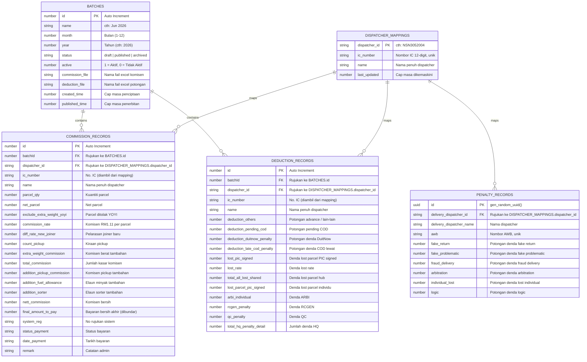

# ENTITY RELATIONSHIP DIAGRAM (Sistem Komisen Mawar Teraju)

Dokumen ini memaparkan hubungan data bagi skema database **DATABASE_V2** menggunakan gambarajah Mermaid.

---

## 1. Gambarajah ERD (Mermaid ERD)

---

## 2. Hubungan Data & Peraturan Kunci Asing (Constraints)

1.  **Kunci Utama (Primary Key - PK)**:
    *   Setiap object store mempunyai kunci utama yang unik untuk rujukan langsung (O(1) lookup).
2.  **Kunci Asing (Foreign Key - FK)**:
    *   Store `commission_records` dan `deduction_records` merujuk kepada `batches.id` melalui medan `batchId`.
    *   Kedua-dua store rekod tersebut juga merujuk kepada `dispatcher_mappings.dispatcher_id` melalui medan `dispatcher_id`.
3.  **Kesan Pemadaman (Cascade Delete Rule)**:
    *   Apabila suatu entri `batches` dipadamkan, transaksi pangkalan data akan memicu pemadaman melata secara automatik bagi semua rekod yang berkaitan pada `commission_records` dan `deduction_records` yang mempunyai `batchId` yang sama. Ini menghalang kewujudan data tergantung (orphaned data).
4.  **Kunci Carian Dispatcher**:
    *   Indeks komposit `batch_ic` pada `commission_records` dan `deduction_records` menggabungkan `batchId` dan `ic_number`. Ini membolehkan carian pantas terus dilakukan tanpa perlu melakukan silangan jadual `dispatcher_mappings` yang perlahan pada runtime carian.
