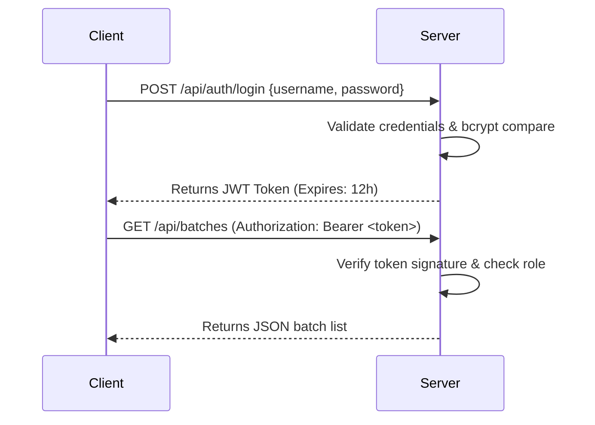

# Security Architecture - Commission Lookup System

Dokumen ini memperincikan standard pengerasan keselamatan (security hardening) bagi melindungi integriti data komisen dan maklumat sensitif Nombor Kad Pengenalan (NRIC) dispatcher.

---

## 1. Aliran Autentikasi JWT (JWT Flow)

Sesi pentadbir (Admin) diuruskan secara tanpa keadaan (stateless) menggunakan **JSON Web Tokens (JWT)**.



### Konfigurasi Token:
*   **Algoritma**: HS256 (HMAC SHA-256)
*   **Jangka Hayat (Expiration)**: 12 jam (sesuai untuk shift kerja pentadbir)
*   **Penyimpanan Klien**: Disimpan di dalam `localStorage` secara selamat. Dipadam secara automatik apabila butang Log Keluar (Logout) ditekan.

---

## 2. Penyulitan Kata Laluan (Password Encryption)

Semua kata laluan pengguna (Admin) yang disimpan di dalam PostgreSQL disulitkan menggunakan algoritma **bcrypt** (pustaka `bcryptjs`).

*   **Rounds (Salt Factor)**: 10 (nilai standard industri untuk prestasi dan kekuatan kriptografi)
*   **Simpanan Pangkalan Data**: Hanya `password_hash` disimpan. Tiada storan teks nyata (*plain-text*) dibenarkan.
*   **Proses Padanan**: Menggunakan `bcrypt.compare()` di bahagian pelayan untuk menghalang pendedahan kata laluan.

---

## 3. Matriks Kebenaran Peranan (RBAC Matrix)

Sistem menguatkuasakan kawalan akses berasaskan peranan (*Role-Based Access Control*) pada peringkat middleware Express bagi setiap endpoint API.

| Endpoint API | Method | Peranan Dibenarkan | Tujuan Utama |
| :--- | :--- | :--- | :--- |
| `/api/auth/login` | `POST` | Awam (Public) | Log masuk pentadbir |
| `/api/dispatch/search` | `GET` | Awam (Public) | Carian invois komisen rider menggunakan IC |
| `/api/batches` | `GET` | Admin & Awam | Senarai batch (Awam hanya melihat `published`) |
| `/api/auth/change-password` | `POST` | Admin Sahaja | Mengemas kini kata laluan admin |
| `/api/batches` | `POST` | Admin Sahaja | Memuat naik fail Excel & membina batch |
| `/api/batches/:id/status` | `POST` | Admin Sahaja | Menukar status batch (Draft/Published/Archived) |
| `/api/batches/:id` | `DELETE` | Admin Sahaja | Memadam batch (Cascading Rollback) |
| `/api/admin/audit-logs` | `GET` | Admin Sahaja | Memantau log audit sistem |
| `/api/admin/audit-logs` | `DELETE` | Admin Sahaja | Memadam keseluruhan log audit |

---

## 4. Perlindungan Had Kadar API (Rate Limiting)

Untuk menghalang cubaan carian nombor Kad Pengenalan secara rawak oleh bot/skrip automasi (brute-force attack), middleware `express-rate-limit` dikuatkuasakan pada endpoint carian dispatcher.

*   **Endpoint Dilindungi**: `/api/dispatch/search`
*   **Kekunci Tapisan**: Alamat IP klien (`req.ip`)
*   **Polisi Had**: Maksimum **15 permohonan** bagi setiap **5 minit**.
*   **Response (429 Too Many Requests)**:
    ```json
    {
      "success": false,
      "code": "TOO_MANY_REQUESTS",
      "error": "Had kadar carian melebihi had dibenarkan. Sila cuba lagi dalam masa 5 minit."
    }
    ```

---

## 5. Sanitasi & Pengesahan Payload (Payload Sanitation)

*   **Input IC Number Validation**: 
    Nombor IC yang dihantar oleh klien disanitasi di bahagian pelayan sebelum sebarang query SQL dijalankan:
    *   Hapuskan sebarang aksara bukan digit dan simbol sengkang (`-`).
    *   Format diseragamkan kepada 12 digit (contoh: `920101105433`).
    *   Pengesahan regex: `^\d{12}$` bagi menapis cubaan serangan SQL Injection.
*   **SQL Parameterization**:
    Semua query ke PostgreSQL menggunakan parameter dinamis (contoh: `SELECT * FROM mappings WHERE ic_number = $1`) melalui library `pg`. Tiada penggabungan rentetan (*string concatenation*) dibenarkan bagi menolak ancaman **SQL Injection (SQLi)**.
*   **CORS Configuration**:
    Express menyekat capaian daripada domain luar yang tidak dibenarkan melalui middleware `cors` dengan hanya membenarkan domain asal aplikasi di-whitelist.
