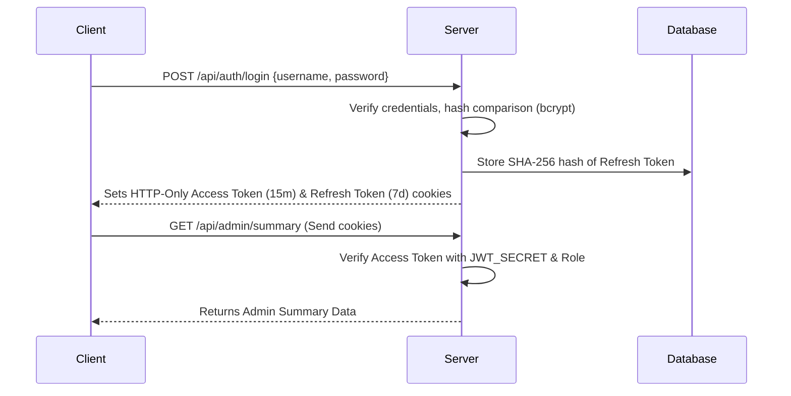

# Security Architecture - Mawar Teraju Commission System

This document outlines the security hardening policies, architectural designs, and countermeasures implemented in the backend system to protect NRIC dispatcher information, commission data, and administrative portals.

---

## 1. Authentication & Session Lifecycles (Stateless JWT)

The authentication module is state-separated and runs on stateless **JSON Web Tokens (JWT)**.

### Token Configuration & Rotation:
- **Access Token**:
  - Signed using `JWT_SECRET`.
  - Expiration: **15 minutes** (minimize replay window).
  - Storage: Transmitted via HTTP-Only, Secure, SameSite=Strict cookie named `accessToken`.
- **Refresh Token**:
  - Signed using `JWT_REFRESH_SECRET` to support key separation.
  - Expiration: **7 days** (removes the need for constant re-authentication).
  - Storage: Transmitted via HTTP-Only, Secure, SameSite=Strict cookie named `refreshToken`.
- **Session Revocation**:
  When a user logs out, the refresh token's SHA-256 hash is marked with a `revoked_at` timestamp in the database, invalidating the session immediately.

---

## 2. Refresh Token Storage & Hashing (One-Way Hashing)

To protect active user sessions against database disclosure attacks, raw refresh tokens are never stored in the database.

- **Storage Format**: Only the **SHA-256 one-way cryptographic hash** of the refresh token is stored in the `token_hash` column of the `user_refresh_tokens` table.
- **Verification Flow**: 
  1. The incoming token is decoded.
  2. The raw string token is hashed: `SHA-256(token)`.
  3. The database is queried for `token_hash = SHA-256(token)`.
  4. If the record exists, is active (not expired), and has not been revoked (`revoked_at IS NULL`), access is granted.

---

## 3. Database UUID Standard (Cryptographic Identifiers)

To prevent resource enumeration attacks (Insecure Direct Object Reference - IDOR), sequential numeric primary keys (`SERIAL` or `BIGSERIAL`) are prohibited.
- **UUID version 4**: All primary keys across all PostgreSQL tables (`users`, `user_refresh_tokens`, `audit_logs`) use 128-bit cryptographically random UUIDs generated natively by the database using `gen_random_uuid()`.

---

## 4. Security Audit Trail (Automatic Monitoring)

Every critical security event is tracked inside the `audit_logs` table:
- **Captured Fields**: UUID `id`, `user_id` (null if anonymous/failed), `action`, `ip_address`, `user_agent`, `status` (`SUCCESS` or `FAILED`), and `details` (`JSONB` mapping).
- **Auto-Logged Actions**:
  - `LOGIN_SUCCESS`: Records the user UUID and metadata.
  - `LOGIN_FAILED`: Records the username, failure reason, and client metadata.
  - `LOGOUT`: Records session termination.
  - `INVALID_JWT`: Logs signatures mismatches, tampering, or expired tokens.
  - `REFRESH_TOKEN_USAGE`: Records session rotation activity.

---

## 5. Password Complexity Policy

All user passwords must satisfy the following strict validation checks, enforced via `express-validator` at the API boundary:
1. **Length**: Minimum 12 characters.
2. **Complexity**: Must contain at least:
   - One uppercase letter (`[A-Z]`).
   - One lowercase letter (`[a-z]`).
   - One numeric digit (`[0-9]`).
   - One special character (e.g. `@`, `$`, `#`, `!`, `&`).

Passwords are saved using **Bcrypt** hashing with a high work factor salt of **12 rounds**.

---

## 6. Route-Specific Rate Limiting

The application rejects a single global rate limiter in favor of individual throttles attached per-route:

| Limiter | Target Endpoint | Limit | Timeout | Purpose |
| :--- | :--- | :--- | :--- | :--- |
| `loginLimiter` | `POST /api/auth/login`, `/refresh` | **5 requests** | 1 minute | Prevents credential stuffing / brute-force |
| `searchLimiter` | `GET /api/dispatch/commissions` | **100 requests** | 1 minute | Prevents IC enumeration |
| `uploadLimiter`| `PUT /api/batches/:id/upload` | **20 requests** | 1 minute | Protects disk / upload streaming channels |
| `adminLimiter` | `GET /api/admin/*` | **60 requests** | 1 minute | Throttles administrative operations |

When thresholds are breached, the client receives a `429 Too Many Requests` status code with the standardized code `AUTH_RATE_LIMIT_EXCEEDED`.

---

## 7. Security Header & Input Protection

- **Helmet CSP Headers**: Custom Content Security Policy rules restrict style, script, image, and connect channels, blocking Cross-Site Scripting (XSS) and iframe-jacking.
- **XSS Sanitization**: Input fields like the `username` are parsed and HTML-escaped using `express-validator.escape()` before routing.
- **SQL Injection Prevention**: All queries to PostgreSQL use parameterization (`$1`, `$2`) to separate code from data.
- **HTTP Cookies**: Access and Refresh tokens are flagged with:
  - `httpOnly`: Blocks JavaScript access, preventing cross-site scripting (XSS) token theft.
  - `secure`: Restricts cookie transmission to HTTPS-encrypted channels only.
  - `sameSite=strict`: Prevents cross-site request forgery (CSRF) attacks.
